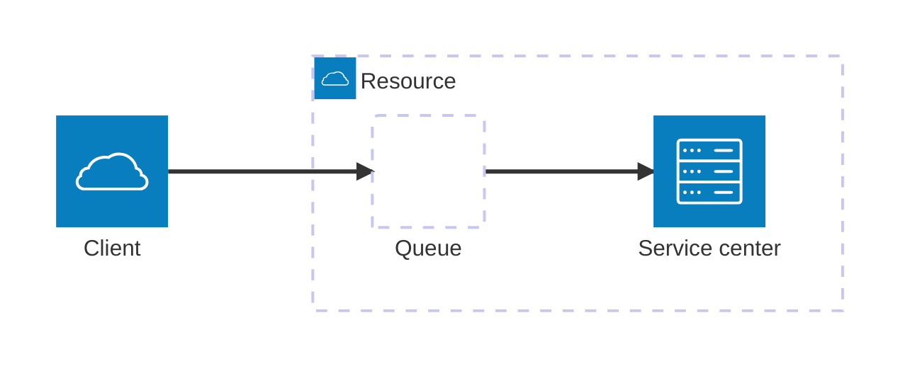

# Metrics design cheat sheet

Steps:
1. Define the scope of the system under measurement
1. Create a list of questions about the system you need answered
1. Create a model of the system (with diagram)
    1. Mark boundaries, inputs/outputs
    1. List known internal state
    1. List known resources/service centers, and select appropriate (sub)model for them
1. Use the model to generate more questions
1. Define lagging metrics
1. Create leading metrics using the model
1. Mark measurement points on the model
    1. Probes (internal state)
    1. Natural measurement points (boundaries, input/output)
1. Use the model to derive metric sets (metrics that need to be measured together  Example: Latency needs to be measured with throughput, errors
1. Decide on _resolution_ balancing:
    1. Feedback lag: 5 x time interval, e.g. 5 minutes for one minute resolution
    1. Storage cost
1. Rank metrics according to ROI: how valuable is the metrics/question vs cost

## Common models
Note: metric types often translate to more than one metric per type! e.g. Latency requires multiple metrics (e.g. different percentiles, mean, histogram buckets)

### USE
See [Brendan Gregg's prescription](https://www.brendangregg.com/usemethod.html). This model is a good fit for well defined shared system resources (e.g. CPU, event loop, disks, network bus) performance tracking.

The model defines 3 metric types in the set:
- Utilization - Average time resource was busy
- Saturation - work the resource can't service, often queued
- Errors - work that failed during service

### The Four Golden Signals
Prescribed in the [Google SRE book](https://sre.google/sre-book/table-of-contents/). This model is a good fit for tracking client experience

The model defines 4 metric type in the set:
- Latency (time taken to serve a request)
- Traffic/throughput (how much demand is placed on your system)
- Errors (rate of requests that are failing)
- Saturation (how “full” your service is, often queued/rejected)

### Queue theory
For more details, watch [Queue theory for Node.js engineers](https://youtu.be/9yWjnzWZP2Q?si=Rd3H1zYjC7EswPQm)

Metric types
- Service latency (time it took to service request)
- Overall resource latency (time since accepting request to the queue until finished servicing)
- Throughput (requests queue/services per unit time)
- Errors
- Clients in the system/concurrency/queued requests
- Overflow (requests not queued because queue was full)