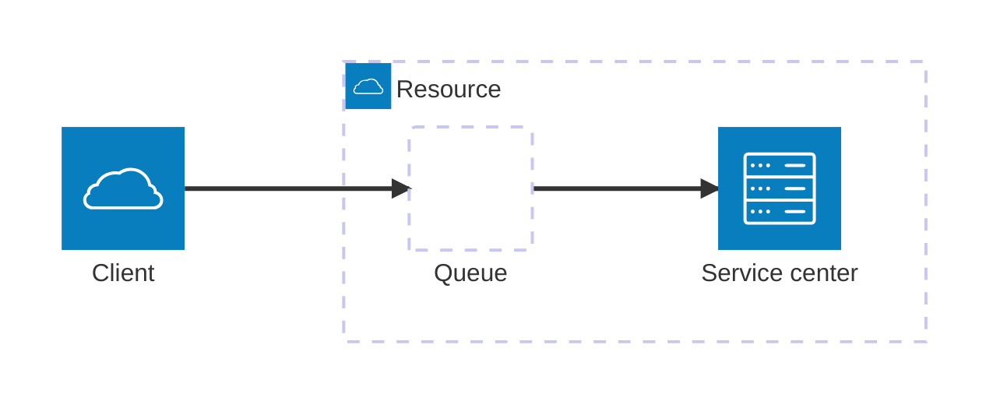

# Metrics design cheat sheet

Steps:
1. Define the scope of the system under measurement
1. Create a list of questions about the system you need answered
1. Create a model of the system (with diagram)
    1. Mark boundaries, inputs/outputs
    1. List known internal state
    1. List known resources/service centers, and select appropriate (sub)model for them
1. Use the model to generate more questions
1. Define lagging metrics
1. Create leading metrics using the model
1. Mark measurement points on the model
    1. Probes (internal state)
    1. Natural measurement points (boundaries, input/output)
1. Use the model to derive metric sets (metrics that need to be measured together  Example: Latency needs to be measured with throughput, errors
1. Decide on _resolution_ balancing:
    1. Feedback lag: 5 x time interval, e.g. 5 minutes for one minute resolution
    1. Storage cost
1. Rank metrics according to ROI: how valuable is the metrics/question vs cost

## Metric types
### Gauges
Gauges are "absolute" values, measured/probed from an external source, E.g. memory used. A gauge has one point per time bucket, which may be derived by (random) probing or some kind of aggregation - usually the _last_ or _random_ value, but the aggregation must assume missing data points, therefor _sum_ cannot be used.
The native upstream time rollup/downsampling for gauges is _mean_, _max_ or _min_ depending on the specific gauge. Aggregation across space dimensions (e.g. multiple servers) is usually _mean_, _max_, _min_

Where possible, prefer using [counters](#counters) over gauges as they are less sensitive to datapoint loss, downsampling effects and are more aggregation friendly

### Counters
Counters count occurrences of an event, they require observing all matching events or equivalent sampling. For each time bucket the derived counter value would be the _sum_ of individual counter values in the bucket. The native upstream time rollup/downsampling for counters is _last_ value, and the natural aggregation across space dimensions (e.g. multiple pods) is _sum_

### Distributions
A distribution is collection of values from individual events, e.g. request latency or payload sizes. Since distributions carry a lot of information, a single metric is not enough to meaningfully deal with them and we must generate a metric set to convey information about the distribution

#### Percentiles
A [percentile](https://en.wikipedia.org/wiki/Percentile) is a threshold for which K percent of values in the distribution are lower than the threshold. E.g. For a group of 1000 values, the 99th percentile is 241 if 990 values are < 241.
Percentiles answer the question "what is the most extreme value P percent of the population observe?"
Percentiles help you understand the dispersion of values in the distribution: E.g. 0.1% is above 843ms, 1% above 202ms, 5% above 56ms, etc.

**Notes**
- Percentiles give no information on the tail of the distribution, thus "hiding" extreme values. They are also limited by bucket sizes - e.g. you need at ~500 points for a meaningful 99th percentile
- Percentiles **do not aggregate**. `mean[p99]` is not a thing; You cannot derive a meaningful representative metric from a group of percentile values, either on the time domain or across a metric cluster (e.g. pods) 

#### Reverse quantiles/reverse percentiles
A reverse quantile of K is the percentage of the values bellow K. E.g. for a group of 1000 values, the reverse quantile of 200 is 0.97 (or 97%) if 970 values are below 200. This answers the question "what part of the population is above/below K?"

Unlike percentiles, reverse quantiles are:
- Cheap to compute
- Aggregatable both in time domain and space
- Can be used on their own for SLI ([Service Level Indicator](https://en.wikipedia.org/wiki/Service_level_indicator))

However, reverse quantiles hide extreme values.

#### Histograms

A [histogram](https://en.wikipedia.org/wiki/Service_level_indicator) is a collection of _buckets_ (aka _beans_) where each bucket contains a count of the population values that fall within it's range. 

Histograms are very versatile:
- Histogram buckets can be aggregated into [reverse quantiles](#reverse-quantilesreverse-percentiles) and vice versa - the sum of buckets < K gives the K reverse quantile. This means you can derive SLI metrics from histograms if bucket thresholds are selected appropriately.
- Histograms with "good enough" resolution can be used to estimate percentile values
- Histograms are aggregatable both in time domain and space
- Histograms make it easy to understand the dispersion of the population using histogram charts, CDF charts or heatmaps

However, histogram require:
- Extra storage as N buckets must be stored per time bucket
- Proper selection of buckets (which may require pre existing knowledge on the distribution)
- Metrics pipeline, storage and graph engines support 

#### Means and Variance measures
[Means](https://en.wikipedia.org/wiki/Mean) (averages) are a sum based aggregation designed to represent a "typical" value of the group. Means are useful for phenomena which is impacted by the whole of the group (e.g. "pressure" or "load") but are generally not use useful for understanding the dispersion of the population as their relation to the dispersion heavily depends on the actual distribution. Avoid using means for assessing service levels. 

[Variance](https://en.wikipedia.org/wiki/Variance) measures are designed to give information on the "width" of population dispersion. There are many difference variance aggregates, but the most common ones (available in metric engines) are [standard deviation](https://en.wikipedia.org/wiki/Standard_deviation) and standard variance. Variance measures are one of the best known indicators for anomalies and various malfunctions.  

## Common models
Note: metric types often translate to more than one metric per type! e.g. Latency requires multiple metrics (e.g. different percentiles, mean, histogram buckets)

### USE
See [Brendan Gregg's prescription](https://www.brendangregg.com/usemethod.html). This model is a good fit for well defined shared system resources (e.g. CPU, event loop, disks, network bus) performance tracking.

The model defines 3 metric types in the set:
- Utilization - Average time resource was busy
- Saturation - work the resource can't service, often queued
- Errors - work that failed during service

### The Four Golden Signals
Prescribed in the [Google SRE book](https://sre.google/sre-book/table-of-contents/). This model is a good fit for tracking client experience

The model defines 4 metric type in the set:
- Latency (time taken to serve a request)
- Traffic/throughput (how much demand is placed on your system)
- Errors (rate of requests that are failing)
- Saturation (how “full” your service is, often queued/rejected)

### Queue theory
For more details, watch [Queue theory for Node.js engineers](https://youtu.be/9yWjnzWZP2Q?si=Rd3H1zYjC7EswPQm)

Metric types
- Service latency (time it took to service request)
- Overall resource latency (time since accepting request to the queue until finished servicing)
- Throughput (requests queue/services per unit time)
- Errors
- Clients in the system/concurrency/queued requests
- Overflow (requests not queued because queue was full)